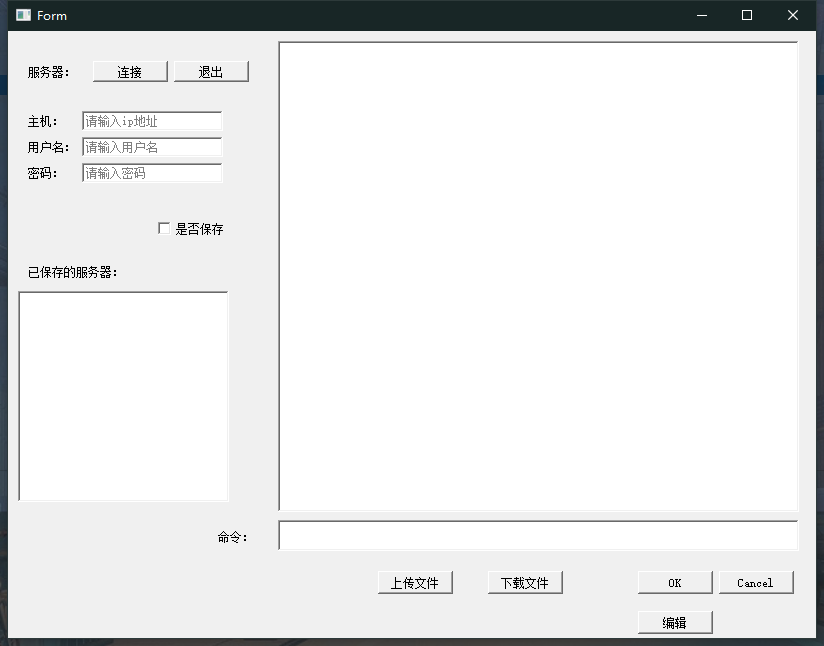

[toc]

# 概述
- 本项目是基于 pyqt5 和 paramiko 设计的远程连接工具 ，类似finalshell(课程设计，差不多就行了--)    
- 主要功能为 连接远程服务器， 上传文件、下载文件、列出远程路径下的文件、获取远程服务器上文件的内容、保存编辑后的文件内容到远程服务器、以及断开连接的功能 
- 项目构造请看下面的分析报告
# 使用
- 打包好的文件
- 或者
  - 下载依赖`pip install requrements`
  - 在项目路径下启动 `python main.py`
- 

# chatGPT 分析报告   

## connection.py

这个文件实现了一个ConnectionManager类，该类封装了连接到远程服务器、上传文件、下载文件、列出远程路径下的文件、获取远程服务器上文件的内容、保存编辑后的文件内容到远程服务器、以及断开连接的功能。其中，连接远程服务器和执行远程指令并返回结果的功能是实现远程操作的核心。该类使用了Python中的Paramiko模块来实现SSH连接，在连接远程服务器时需要传入IP、用户名、密码等参数。实现了上传文件、下载文件、列出远程路径下的文件、获取远程服务器上文件的内容、保存编辑后的文件内容到远程服务器的功能，音介绍了使用OS、Paramiko以及UUID模块的具体使用。最后，该类实现了对连接的断开。

## logger.py

该程序文件实现了一个日志记录器的初始化和设置，并定义了一个获取该日志记录器的函数。其中，日志记录器分别设置了控制台处理器和按文件大小切割的文件处理器，并分别设置了不同的日志级别以及格式化输出。该程序文件使用了 Python 内置的 logging 模块和 logging.handlers 模块。

## main.py

这是一个使用PyQt5构建GUI界面的Python程序，导入了QtWidgets模块和自定义的Mainwindow类。在程序启动时，创建了一个Qt应用程序，并将Mainwindow实例显示在屏幕上。最后调用app.exec_()进入事件循环，等待用户的交互操作。

## saved_info.py

该文件是一个Python模块，名为saved_info.py，包含了一个SavedInfoManager的类，这个类提供了与SQLite数据库交互的方法，允许添加、获取和删除保存的信息。具体来说，这个类实现了创建、连接、关闭数据库文件的功能，并提供了添加、获取、删除保存信息的方法。其中，添加保存信息的方法接收IP地址、用户名和密码作为输入参数，并将这些信息插入到数据库的表中；获取保存信息的方法从数据库表中获取所有保存信息；删除保存信息的方法根据输入的IP地址、用户名和密码从数据库表中删除相应的信息。

## shell.py

该程序文件shell.py是一个使用PyQt5库进行图形用户界面(GUI)设计的程序。程序界面包括一个连接服务器的表单和一些上传、下载、编辑和保存文件的按钮。在setupUI函数中，程序通过设置各个组件的位置和大小构建了GUI。此外，还定义了一些组件的属性和功能。retranslateUI函数用来处理UI界面上的翻译，并连接槽函数。

## shell_ui.py

该文件是一个Python PyQt5程序，主要实现了一个交互式Shell界面。定义了一些处理远程连接和文件操作的函数，同时也包含一些界面UI事件处理的函数，如连接、退出、上传文件、下载文件、编辑等。程序采用了多线程技术，采用QThreadPool和QRunnable类来处理后台任务。程序还包含了一些保存共享信息和记录日志的功能。

## 程序的整体功能和构架概括。

整体来说，这个程序实现了一个连接到远程服务器，实现文件上传、下载、编辑、查看、删除等功能的综合应用。程序采用了Python语言，并结合了PyQt5和其他库的使用，实现了交互界面的构建和后台任务的处理。

以下是每个文件的功能整理：

|    文件名     |                           功能描述                           |
| :-----------: | :----------------------------------------------------------: |
| connection.py | 实现了连接到远程服务器、上传文件、下载文件、列出远程路径下的文件、获取远程服务器上文件的内容、保存编辑后的文件内容到远程服务器、以及断开连接的功能。使用了Python中的Paramiko模块来实现SSH连接。 |
|   logger.py   | 实现了日志记录器的初始化和设置。设置了控制台处理器和按文件大小切割的文件处理器，并分别设置了不同的日志级别以及格式化输出。使用了 Python 内置的 logging 模块和 logging.handlers 模块。 |
|    main.py    | 使用PyQt5构建GUI界面的Python程序，导入了QtWidgets模块和自定义的Mainwindow类。在程序启动时，创建了一个Qt应用程序，并将Mainwindow实例显示在屏幕上。最后调用app.exec_()进入事件循环，等待用户的交互操作。 |
| saved_info.py | 提供与SQLite数据库交互的方法，允许添加、获取和删除保存的信息。其中，添加保存信息的方法接收IP地址、用户名和密码作为输入参数，并将这些信息插入到数据库的表中；获取保存信息的方法从数据库表中获取所有保存信息；删除保存信息的方法根据输入的IP地址、用户名和密码从数据库表中删除相应的信息。 |
|   shell.py    | 使用PyQt5进行图形用户界面(GUI)设计的程序。程序界面包括一个连接服务器的表单和一些上传、下载、编辑和保存文件的按钮。在setupUI函数中，程序通过设置各个组件的位置和大小构建了GUI。此外，还定义了一些组件的属性和功能。retranslateUI函数用来处理UI界面上的翻译，并连接槽函数。 |
|  shell_ui.py  | 实现了一个交互式Shell界面。定义了一些处理远程连接和文件操作的函数，同时也包含一些界面UI事件处理的函数，如连接、退出、上传文件、下载文件、编辑等。程序采用了多线程技术，采用QThreadPool和QRunnable类来处理后台任务。程序还包含了一些保存共享信息和记录日志的功能。 |